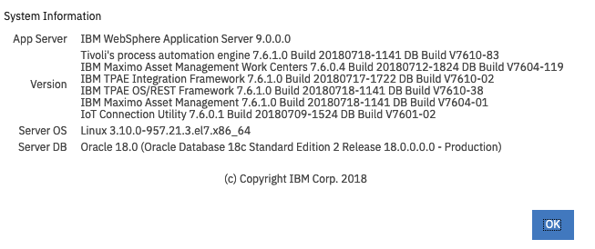

// Add steps as necessary for accessing the software, post-configuration, and testing. Don’t include full usage instructions for your software, but add links to your product documentation for that information.
//Should any sections not be applicable, remove them

== Test the deployment
// If steps are required to test the deployment, add them here. If not, remove the heading

. Navigate to the website URL that is as shown in the *WebsiteURL* row in the *Outputs* tab in <<cfn_outputs>>.
. On the {partner-product-short-name} Enterprise Asset Management login page, provide the default username/password as `maxadmin`.
. Once logged in, choose the *Help* icon and then choose *System Information*.
. In the *System Information* pop-up window, verify that {partner-product-short-name} Asset Management has been successfully installed, as shown in <<testStep1>>:

:xrefstyle: short
[#testStep1]
.{partner-product-short-name} system information
[link=images/system-information.png]

== Post deployment steps

IMPORTANT: Be sure to change the default password after installation.

To change the default password, choose the *Profile* icon and then *Password Information*.
On the *Password Information* pop-up window, enter a new password and choose *OK*, as shown in <<postDeployStep1>>.

:xrefstyle: short
[#postDeployStep1]
.{partner-product-short-name} change password
[link=images/change-password.png]
image::../images/change-password.png[image_placeholder,width=648,height=439]

== Best practices for using {partner-product-short-name} on AWS
// Provide post-deployment best practices for using the technology on AWS, including considerations such as migrating data, backups, ensuring high performance, high availability, etc. Link to software documentation for detailed information.

See https://www.ibm.com/support/pages/sites/default/files/inline-files/$FILE/Maximo%20Best%20Practices%20for%20System%20Performance%207.6.x.pdf[IBM Maximo best practices for system performance^].