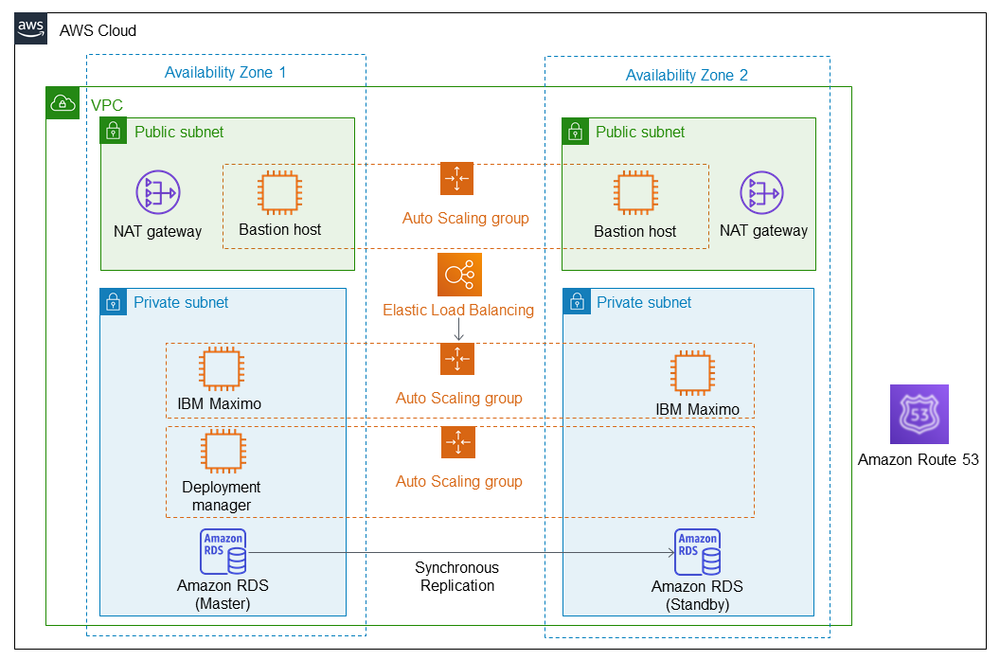

Deploying this Quick Start for a new virtual private cloud (VPC) with
default parameters builds the following {partner-product-short-name} environment in the AWS Cloud.

// Replace this example diagram with your own. Send us your source PowerPoint file. Be sure to follow our guidelines here : http://(we should include these points on our contributors giude)
[#architecture1]
.Quick Start architecture for {partner-product-short-name} on AWS
[link=images/maximo-architecture-diagram.png]

As shown in Figure 1, the Quick Start sets up the following:

* A highly available architecture that spans multiple Availability Zones.*
* A VPC configured with public and private subnets according to AWS best practices, to provide you with your own virtual network on AWS.*
* In the public subnets:
 ** Managed network address translation (NAT) gateways to allow outbound internet access for resources in the private subnets.
 ** A Linux bastion host in an Auto Scaling group to allow inbound Secure Shell (SSH) access to EC2 instances in public and private subnets.
 ** Elastic Load Balancing (ELB) to balance traffic between the {partner-product-short-name} application servers.

* In the private subnets:
// Add bullet points for any additional components that are included in the deployment. Make sure that the additional components are also represented in the architecture diagram.
 ** {partner-product-short-name} application servers deployed across two Availability Zones, offering high availability.
 ** A deployment manager in an Auto Scaling group used for configuring tasks during deployment and managing application servers. The desired capacity should be set to one instance. 
 ** Amazon RDS for Oracle as the database for {partner-product-short-name}, also deployed across two Availability Zones.

* (Optional) Amazon Route 53 as your public Domain Name System (DNS) for resolving your {partner-product-short-name} website’s domain name.

*The template that deploys the Quick Start into an existing VPC skips the components marked by asterisks and prompts you for your existing VPC configuration.